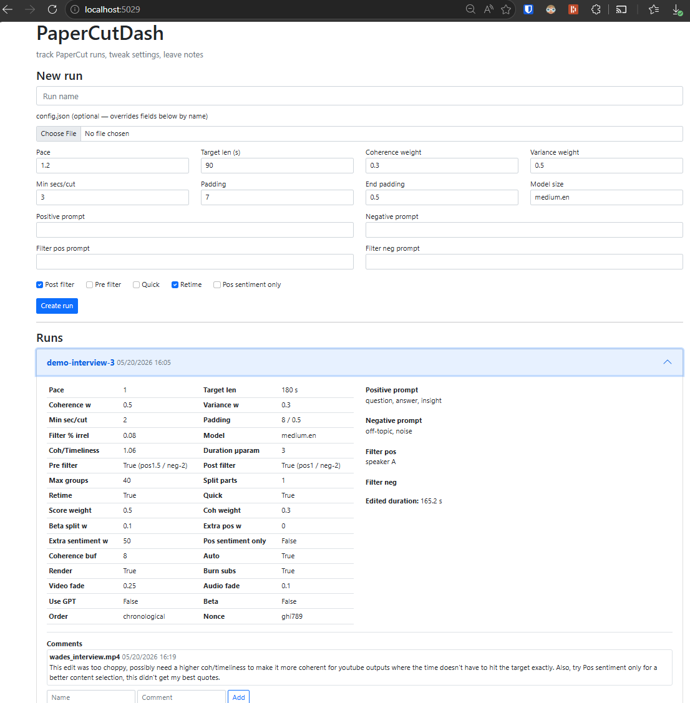

# PaperCutDash

A hyperparameter tracking dashboard for PaperCut AI video editor, built with **ASP.NET Core 8 MVC**. Enables experimentation teams to log editing runs with 40+ tunable hyperparameters, upload configuration presets via JSON, and collaboratively document results through inline comments. Designed to discover optimal clustering parameters, NSP thresholds, and coherence levels for different media types (podcasts, interviews, observational footage, focus groups).

## Tech Stack

- **Framework**: ASP.NET Core 8, MVC architectural pattern
- **ORM**: Entity Framework Core with async/await support
- **Database**: SQLite with automatic schema migration on startup
- **Testing**: xUnit with EF Core In-Memory providers
- **Architecture**: Dependency injection, repository pattern via DbContext

## Core Architecture

### Models & Relationships
- **Run**: Primary entity with 40+ hyperparameter properties (Pace, CoherenceWeight, TargetOutputLenSeconds, etc.) + output tracking (EditedDuration, EditedSrt, PacedSrt)
- **Comment**: Audit trail entity with one-to-many relationship to Run. Supports author attribution and timestamp tracking
- Automatic timestamp generation and unique ID assignment via Guid

### Controller Logic
**RunsController** handles three main endpoints:
1. **Index (GET)**: Lists all runs with pagination support, auto-seeds database with demo data on first load
2. **Create (POST)**: Accepts Run model binding + optional JSON config file uploads
   - Reflection-based property mapping (fields are matched by name to model properties)
   - Type-safe parsing for double, int, bool, string types
   - Graceful error handling for malformed JSON and unknown fields
3. **Comment (POST)**: Adds team comments to runs for collaborative experiment documentation

### JSON Config Parsing
Uses `System.Reflection` and `System.Text.Json` to dynamically map JSON config properties to model fields:
```csharp
var prop = typeof(Run).GetProperty(p.Name);
if (prop?.CanWrite) { /* type-safe assignment */ }
```
Unknown fields are silently skipped (no errors). Supports extensibility—new Run properties are automatically mappable.

### Data Persistence
- **EF Core DbContext** with lazy-loading of Comments collection
- **Migrations**: Auto-generated on startup via `EnsureCreated()` 
- **Seeding**: Initial 3 demo runs with realistic hyperparameter presets and sample comments
- **Async operations**: All database calls use `async/await` for non-blocking I/O

## How It Works

1. **Home View** displays all runs in collapsible cards, sorted by creation date (newest first)
2. **Create Form** accepts:
   - Run name (required)
   - Inline hyperparameter inputs (optional)
   - JSON config file upload (optional, overrides inline values)
3. **Comment Section** under each run lets team members leave timestamped notes with author attribution

## Getting Started

```bash
dotnet run
```

Server listens on `http://localhost:5029`. Navigate to `/Runs` to view dashboard.



### Creating a Run with JSON Config

```json
{
  "Name": "interview-01",
  "Pace": 1.2,
  "CoherenceWeight": 0.4,
  "PositivePrompt": "key insights, speaker A",
  "NegativePrompt": "filler, background noise",
  "TargetOutputLenSeconds": 180,
  "ModelSize": "large",
  "Quick": true
}
```

Upload this file via the form. The controller will parse and assign all matching properties. Fields not present in the model are ignored.

## Testing

Comprehensive test suite covering:
- **Data seeding**: Ensures demo data loads exactly once
- **CRUD operations**: Run creation with and without config files
- **Validation**: Name required, JSON parsing, type coercion
- **Relationships**: Comments correctly associated to Runs
- **Edge cases**: Unknown JSON fields, null author defaults to "anon"

```bash
dotnet test
```

EF Core In-Memory provider for fast, isolated test execution. Each test gets a fresh database instance.
